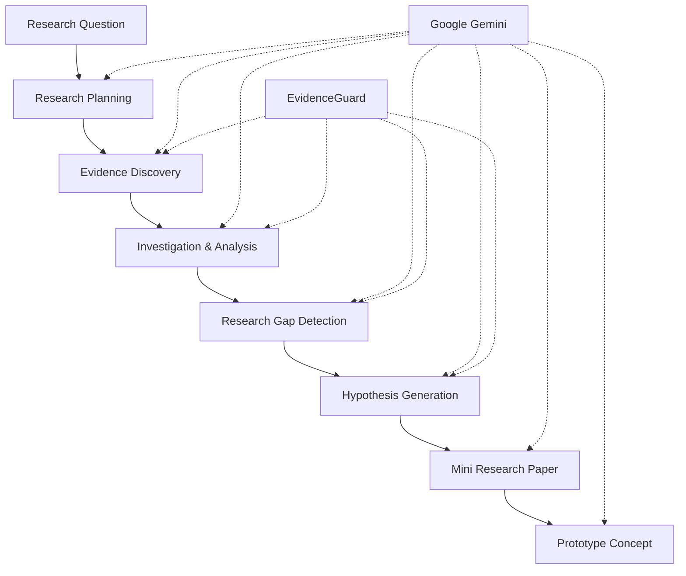

# 🚀 ResearchPilotAI

### From Question to Discovery. From Discovery to Innovation.

🔗 **Live Demo:** [Explore ResearchPilotAI](https://researchpilotai.ai.studio/)

> **What if AI could do more than answer research questions? What if it could help investigate them — and turn discoveries into innovation?**

ResearchPilotAI is a domain-agnostic AI research and innovation agent that transforms an initial research question into a structured investigation, evidence-informed insights, potential research gaps, testable hypotheses, a mini research paper, and a prototype concept.

---

## 🔬 The Idea

Research is often fragmented across literature discovery, evidence analysis, hypothesis development, and academic writing. Translating research findings into practical solutions adds another layer of complexity.

**ResearchPilotAI connects these stages into one intelligent research-to-innovation workflow.**

Rather than focusing solely on answering questions, it aims to help users structure investigations, organize evidence, explore research opportunities, and identify how discoveries could lead to practical solutions.

## ✨ Core Innovation

* **Beyond Question Answering:** Connects multiple stages of research in a unified workflow.
* **Evidence-Aware Research:** Distinguishes sourced evidence, data-derived findings, AI interpretations, proposed hypotheses, and insufficient evidence.
* **Research-Gap Exploration:** Helps identify potential contradictions, methodological limitations, and underexplored areas.
* **Research-to-Innovation:** Connects research outcomes with potential applications, prediction systems, dashboards, simulations, and prototypes.

## 🏗️ Core Architecture

ResearchPilotAI combines a structured research pipeline with Gemini-powered generative AI capabilities and an evidence-awareness layer.

### Architecture Components

| Component             | Role                                                                                                                     |
| --------------------- | ------------------------------------------------------------------------------------------------------------------------ |
| Research Pipeline     | Organizes the research process into connected stages.                                                                    |
| Gemini AI Layer       | Supports research planning, evidence synthesis, interpretation, and structured content generation.                       |
| EvidenceGuard         | Provides an evidence-awareness framework for distinguishing sourced claims from interpretations and proposed hypotheses. |
| Research Output Layer | Structures investigation results into a mini research paper and a potential prototype concept.                           |

*The diagram presents the conceptual architecture. Individual stages and components should be interpreted according to their actual implementation in the application.*

## 🧪 Demonstration: From Question to Innovation

**Example research question:**

*Can machine learning help predict urban flood risk?*

ResearchPilotAI uses this question to illustrate how an initial idea can progress through a structured research investigation.

**Question → Research Plan → Evidence → Investigation → Research Gap → Hypothesis → Mini Research Paper → Prototype Concept**

The resulting prototype concept could explore a machine-learning-based flood-risk prediction system. Building and evaluating such a system would require appropriate datasets, implementation, and validation.

## 🌍 Real-World Impact

ResearchPilotAI is designed to support interdisciplinary research and innovation across:

* 🧬 **Healthcare & Biology** — Exploring biomedical questions and research opportunities.
* 🤖 **AI & Data Science** — Structuring computational investigations and analytical questions.
* 🌱 **Environment & Climate** — Investigating environmental challenges and climate-related problems.
* 🌾 **Agriculture & Engineering** — Exploring research-driven approaches to practical challenges.
* 🎓 **Education & Social Sciences** — Supporting academic inquiry and interdisciplinary projects.

Its broader vision is to make structured research more accessible and reduce the distance between an initial idea and a potential real-world solution.

## 🛠️ Technology Stack

| Layer             | Technologies and Approaches                                                    |
| ----------------- | ------------------------------------------------------------------------------ |
| AI                | Google Gemini models                                                           |
| AI Approach       | Generative AI and agentic AI concepts                                          |
| Frontend          | React and TypeScript                                                           |
| Research Workflow | Evidence synthesis and retrieval-augmented research                            |
| Analysis          | Data analysis, visualization, and machine-learning workflows where appropriate |

The modular approach provides a foundation for integrating additional research sources, datasets, analytical tools, and specialized AI capabilities.

## ⚠️ Responsible Research

ResearchPilotAI is designed to support research, not replace scientific judgment, source verification, experimentation, or peer review.

AI-generated interpretations and hypotheses require appropriate verification before being treated as scientific conclusions. Research findings should be evaluated in the context of their sources, available data, methodological limitations, and the need for further validation.

---

### Research → Discovery → Evidence → Innovation

*We don't just ask AI for answers. We use AI to explore what comes next.*
